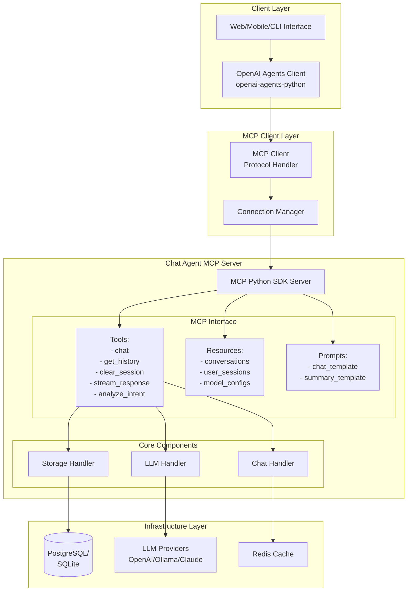

# hello-llm

Welcome to the hello-llm workspace. This repository collects the core services, shared libraries, and operational tooling needed to run and evolve the project.

## Project Structure

```
hello-llm/
|-- apps/                     # Application implementations
|-- docs/                     # Comprehensive documentation
|-- infra/                    # Infrastructure as code
|-- libs/                     # Shared libraries
|-- scripts/                  # Build/test/deploy scripts
|-- services/                 # Service directories
|-- CONTRIBUTING.md           # Contribution guidelines
|-- Makefile                  # Root orchestration
`-- README.md                 # Project overview
```

## Chat Agent System Architecture

### System Overview


