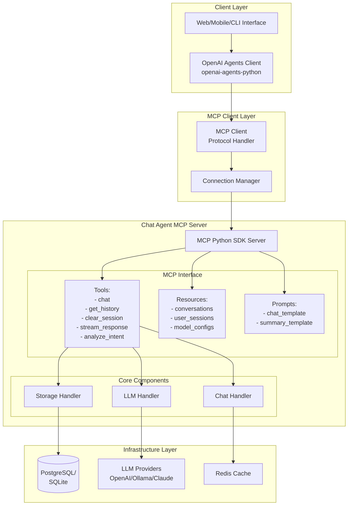

# Chat Agent System Architecture

## System Overview

```mermaid
graph TB
    subgraph "Client Layer"
        UI[Web/Mobile/CLI Interface]
        OAC[OpenAI Agents Client<br/>openai-agents-python]
    end

    subgraph "MCP Client Layer"
        MCPC[MCP Client<br/>Protocol Handler]
        CM[Connection Manager]
    end

    subgraph "Chat Agent MCP Server"
        MCPS[MCP Python SDK Server]

        subgraph "Core Components"
            CH[Chat Handler]
            LH[LLM Handler]
            SH[Storage Handler]
        end

        subgraph "MCP Interface"
            TOOLS[Tools:<br/>- chat<br/>- get_history<br/>- clear_session<br/>- stream_response<br/>- analyze_intent]
            RES[Resources:<br/>- conversations<br/>- user_sessions<br/>- model_configs]
            PROMPTS[Prompts:<br/>- chat_template<br/>- summary_template]
        end
    end

    subgraph "Infrastructure Layer"
        DB[(PostgreSQL/<br/>SQLite)]
        LLMP[LLM Providers<br/>OpenAI/Ollama/Claude]
        CACHE[Redis Cache]
    end

    UI --> OAC
    OAC --> MCPC
    MCPC --> CM
    CM --> MCPS

    MCPS --> TOOLS
    MCPS --> RES
    MCPS --> PROMPTS

    TOOLS --> CH
    TOOLS --> LH
    TOOLS --> SH

    CH --> CACHE
    LH --> LLMP
    SH --> DB
```
