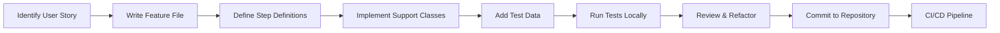

# MCP Server Cucumber Testing Plan

## Table of Contents

1. [Overview](#overview)
2. [Testing Philosophy](#testing-philosophy)
3. [Feature Directory Structure](#feature-directory-structure)
4. [User-Centric Feature Files](#user-centric-feature-files)
   - [First-Time User Journey](#first-time-user-journey)
   - [Conversation Management Journey](#conversation-management-journey)
   - [Model Interaction Journey](#model-interaction-journey)
   - [Session Management Journey](#session-management-journey)
   - [History and Analytics Journey](#history-and-analytics-journey)
5. [Step Definitions Organization](#step-definitions-organization)
6. [User-Focused Test Support Classes](#user-focused-test-support-classes)
7. [Scenario-Based Test Data](#scenario-based-test-data)
8. [Implementation Guidelines](#implementation-guidelines)
9. [Test Execution Strategy](#test-execution-strategy)
10. [CI/CD Integration](#cicd-integration)
11. [Best Practices](#best-practices)
12. [Performance Testing Strategy](#performance-testing-strategy)

---

## Overview

This document outlines the comprehensive Cucumber testing plan for the MCP (Model Context Protocol) Server, focusing on user scenario-based testing approaches. The plan emphasizes behavior-driven development (BDD) principles to ensure that all features are tested from the user's perspective, making tests more maintainable, readable, and aligned with business requirements.

### Key Objectives

- **User-Centric Testing**: All tests are organized around user journeys and scenarios
- **Maintainability**: Clear separation of concerns with modular test architecture
- **Scalability**: Support for parallel execution and easy addition of new scenarios
- **Clarity**: Tests written in natural language that stakeholders can understand
- **Comprehensive Coverage**: End-to-end validation of all user interactions

---

## Testing Philosophy

Our testing approach follows these core principles:

1. **Behavior-First**: Tests describe what the system should do, not how it does it
2. **User Journey Focus**: Tests mirror actual user workflows and expectations
3. **Living Documentation**: Feature files serve as both tests and documentation
4. **Continuous Validation**: Tests run automatically on every change
5. **Fast Feedback**: Quick identification of issues through targeted test execution

---

## Feature Directory Structure

The test suite is organized by user scenarios, providing clear navigation and maintainability:

```
e2e/
├── src/
│   └── test/
│       ├── resources/
│       │   └── features/
│       │       ├── user-scenarios/
│       │       │   ├── first-time-user/
│       │       │   │   ├── onboarding.feature
│       │       │   │   ├── initial-conversation.feature
│       │       │   │   └── getting-help.feature
│       │       │   ├── conversation-management/
│       │       │   │   ├── multi-turn-dialogue.feature
│       │       │   │   ├── conversation-branching.feature
│       │       │   │   ├── conversation-search.feature
│       │       │   │   └── conversation-export.feature
│       │       │   ├── model-interaction/
│       │       │   │   ├── model-selection.feature
│       │       │   │   ├── model-switching.feature
│       │       │   │   ├── streaming-responses.feature
│       │       │   │   └── intent-routing.feature
│       │       │   ├── session-management/
│       │       │   │   ├── session-lifecycle.feature
│       │       │   │   ├── session-recovery.feature
│       │       │   │   ├── multi-device-sync.feature
│       │       │   │   └── session-clearing.feature
│       │       │   ├── history-and-analytics/
│       │       │   │   ├── conversation-history.feature
│       │       │   │   ├── history-filtering.feature
│       │       │   │   ├── usage-analytics.feature
│       │       │   │   └── history-management.feature
│       │       │   └── advanced-features/
│       │       │       ├── context-windows.feature
│       │       │       ├── custom-prompts.feature
│       │       │       ├── tool-integration.feature
│       │       │       └── api-access.feature
│       │       ├── system-scenarios/
│       │       │   ├── multi-user-collaboration/
│       │       │   │   ├── shared-sessions.feature
│       │       │   │   ├── concurrent-access.feature
│       │       │   │   └── collaboration-permissions.feature
│       │       │   ├── high-load-operations/
│       │       │   │   ├── concurrent-users.feature
│       │       │   │   ├── bulk-operations.feature
│       │       │   │   └── rate-limiting.feature
│       │       │   └── failure-recovery/
│       │       │       ├── connection-failures.feature
│       │       │       ├── model-unavailability.feature
│       │       │       └── data-recovery.feature
│       │       └── admin-scenarios/
│       │           ├── configuration-management/
│       │           │   ├── system-configuration.feature
│       │           │   ├── model-configuration.feature
│       │           │   └── user-management.feature
│       │           └── system-monitoring/
│       │               ├── health-checks.feature
│       │               ├── performance-metrics.feature
│       │               └── audit-logs.feature
│       └── java/
│           └── com/
│               └── mcp/
│                   └── test/
│                       ├── steps/
│                       │   ├── user_actions/
│                       │   │   ├── AuthenticationSteps.java
│                       │   │   ├── ConversationSteps.java
│                       │   │   ├── NavigationSteps.java
│                       │   │   └── ConfigurationSteps.java
│                       │   ├── system_responses/
│                       │   │   ├── ResponseValidationSteps.java
│                       │   │   ├── StreamingSteps.java
│                       │   │   └── ErrorMessageSteps.java
│                       │   └── state_verification/
│                       │       ├── SessionStateSteps.java
│                       │       ├── HistoryStateSteps.java
│                       │       └── SystemStateSteps.java
│                       ├── support/
│                       │   ├── personas/
│                       │   │   ├── TestUser.java
│                       │   │   ├── UserSession.java
│                       │   │   └── ConversationContext.java
│                       │   ├── actions/
│                       │   │   ├── ChatActions.java
│                       │   │   ├── SessionActions.java
│                       │   │   └── HistoryActions.java
│                       │   └── assertions/
│                       │       ├── ResponseAssertions.java
│                       │       ├── UIAssertions.java
│                       │       └── PerformanceAssertions.java
│                       └── hooks/
│                           ├── ScenarioHooks.java
│                           └── TestDataHooks.java
├── test-data/
│   ├── personas/
│   │   ├── new_users.json
│   │   ├── power_users.json
│   │   └── admin_users.json
│   ├── conversations/
│   │   ├── simple_qa.json
│   │   ├── complex_dialogue.json
│   │   └── edge_cases.json
│   └── expected_outcomes/
│       ├── response_templates.json
│       ├── error_messages.json
│       └── performance_sla.json
└── config/
    ├── cucumber.properties
    ├── environments/
    │   ├── local.properties
    │   ├── dev.properties
    │   ├── staging.properties
    │   └── production.properties
    └── test-suites/
        ├── smoke.json
        ├── regression.json
        └── performance.json
```

---

## User-Centric Feature Files

### First-Time User Journey

#### Example: Onboarding Feature

```gherkin
# features/user-scenarios/first-time-user/onboarding.feature

@first-time-user @onboarding @critical
Feature: First-Time User Onboarding
  As a new user of the MCP Server
  I want to be guided through the initial setup
  So that I can start using the service effectively

  Background:
    Given I am a first-time user accessing the MCP Server
    And the system is running with default configuration

  @smoke
  Scenario: Successful first-time registration
    When I navigate to the MCP Server home page
    Then I should see the welcome screen with registration options
    When I choose to create a new account
    And I provide valid registration details:
      | Field    | Value                |
      | Username | newuser123          |
      | Email    | newuser@example.com |
      | Password | SecurePass123!      |
    Then I should receive a confirmation message
    And I should be automatically logged in
    And I should see the onboarding tutorial

  @guided-tour
  Scenario: Interactive onboarding tutorial
    Given I have just completed registration
    When I start the interactive tutorial
    Then I should see step-by-step instructions for:
      | Feature                  | Description                           |
      | Starting a conversation  | How to initiate chat with the model  |
      | Selecting models        | Choosing between available AI models  |
      | Managing conversations  | Saving and organizing chats           |
      | Accessing help         | Finding documentation and support     |
    And I should be able to skip the tutorial at any time
    And I should be able to restart it from settings

  @default-settings
  Scenario Outline: Setting initial preferences
    Given I am in the onboarding flow
    When I reach the preferences section
    And I set my "<preference>" to "<value>"
    Then the system should save my preference
    And apply it to my future sessions

    Examples:
      | preference        | value           |
      | default_model     | gpt-4          |
      | theme            | dark           |
      | language         | English        |
      | response_format  | conversational |
```

### Conversation Management Journey

#### Example: Multi-Turn Dialogue Feature

```gherkin
# features/user-scenarios/conversation-management/multi-turn-dialogue.feature

@conversation @multi-turn @core
Feature: Multi-Turn Dialogue Management
  As a user engaged in complex discussions
  I want to maintain context across multiple exchanges
  So that I can have coherent, contextual conversations

  Background:
    Given I am logged in as a regular user
    And I have started a new conversation session

  @context-retention
  Scenario: Maintaining context across multiple turns
    When I send my first message "Tell me about quantum computing"
    And I receive a response about quantum computing basics
    When I follow up with "How does it differ from classical computing?"
    Then the response should reference my previous question
    And maintain the context of quantum computing
    When I ask "What are its practical applications?"
    Then the response should build upon the previous exchanges
    And demonstrate understanding of the conversation flow

  @conversation-branching
  Scenario: Creating conversation branches
    Given I have an existing conversation with 5 messages
    When I select message number 3
    And I choose to "branch from here"
    And I send an alternative follow-up question
    Then a new conversation branch should be created
    And I should be able to switch between branches
    And each branch should maintain its own context

  @context-window
  Scenario: Managing long conversations
    Given I have a conversation with 50 messages
    When I continue the conversation
    Then the system should maintain relevant context
    And automatically manage the context window
    When I explicitly reference an early message
    Then the system should be able to recall that context
    And provide accurate responses based on the full history
```

### Model Interaction Journey

#### Example: Model Switching Feature

```gherkin
# features/user-scenarios/model-interaction/model-switching.feature

@model-interaction @switching @important
Feature: Dynamic Model Switching
  As a power user
  I want to switch between different AI models during conversations
  So that I can leverage the strengths of each model

  Background:
    Given I am logged in with model switching privileges
    And multiple models are available:
      | Model Name | Specialty           | Status    |
      | GPT-4      | General purpose    | Available |
      | Claude-3   | Long context       | Available |
      | Llama-2    | Open source        | Available |
      | Gemini     | Multimodal         | Available |

  @mid-conversation-switch
  Scenario: Switching models mid-conversation
    Given I am in an active conversation using "GPT-4"
    And I have exchanged 3 messages
    When I select "Switch Model" from the options
    And I choose "Claude-3" from the available models
    Then the model should switch successfully
    And the conversation context should be preserved
    When I send my next message
    Then the response should come from "Claude-3"
    And maintain continuity with previous messages

  @model-comparison
  Scenario: Comparing responses from different models
    Given I have typed a question but not sent it
    When I enable "Compare Models" mode
    And I select models: "GPT-4", "Claude-3", "Gemini"
    And I send the question
    Then I should receive parallel responses from all selected models
    And each response should be clearly labeled with the model name
    And I should be able to choose which response to continue with
```

### Session Management Journey

#### Example: Session Recovery Feature

```gherkin
# features/user-scenarios/session-management/session-recovery.feature

@session @recovery @reliability
Feature: Session Recovery and Persistence
  As a user who may experience interruptions
  I want my sessions to be recoverable
  So that I don't lose my conversation progress

  Background:
    Given I am logged in as "user@example.com"
    And I have session recovery enabled

  @auto-save
  Scenario: Automatic session saving
    Given I am in an active conversation
    When I type a message without sending
    Then the draft should be auto-saved every 5 seconds
    When I navigate away from the page
    And I return within 24 hours
    Then my draft message should be restored
    And the conversation state should be preserved

  @connection-recovery
  Scenario: Recovering from connection loss
    Given I am in an active conversation
    And I have sent a message that is being processed
    When my internet connection is lost
    Then the UI should indicate connection issues
    When the connection is restored within 5 minutes
    Then the session should automatically reconnect
    And any pending responses should be delivered
    And no messages should be lost

  @multi-device-sync
  Scenario: Cross-device session synchronization
    Given I have an active session on my laptop
    When I log in on my mobile device
    Then I should see my current conversations
    When I send a message from my mobile device
    Then the conversation should update on my laptop in real-time
    And the session state should remain synchronized
```

### History and Analytics Journey

#### Example: Conversation History Feature

```gherkin
# features/user-scenarios/history-and-analytics/conversation-history.feature

@history @analytics @search
Feature: Conversation History and Search
  As a user with many past conversations
  I want to search and manage my conversation history
  So that I can find and reference previous discussions

  Background:
    Given I am logged in as a user with 100+ past conversations
    And conversations span the last 6 months

  @history-search
  Scenario: Searching conversation history
    When I navigate to the conversation history page
    And I search for "machine learning algorithms"
    Then I should see conversations containing that phrase
    And results should be sorted by relevance
    When I apply filters:
      | Filter Type | Value           |
      | Date Range  | Last 30 days   |
      | Model Used  | GPT-4          |
      | Has Attachments | Yes        |
    Then the results should be refined accordingly
    And I should see the match count

  @history-export
  Scenario: Exporting conversation history
    Given I have selected 5 conversations
    When I choose "Export Selected"
    And I select export format "JSON"
    Then a download should start
    And the exported file should contain:
      | Content              | Included |
      | Messages            | Yes      |
      | Timestamps          | Yes      |
      | Model Information   | Yes      |
      | User Metadata       | Yes      |
      | Attachments Links   | Yes      |

  @usage-analytics
  Scenario: Viewing usage analytics
    When I navigate to my analytics dashboard
    Then I should see metrics including:
      | Metric                    | Time Period    |
      | Total conversations       | All time       |
      | Messages sent            | Last 30 days   |
      | Most used models         | Last 30 days   |
      | Average response time    | Last 7 days    |
      | Peak usage hours         | Last 7 days    |
    And I should be able to export analytics data
```

---

## Step Definitions Organization

### User Actions Steps

#### AuthenticationSteps.java

```java
package com.mcp.test.steps.user_actions;

import io.cucumber.java.en.*;
import com.mcp.test.support.personas.TestUser;
import com.mcp.test.support.actions.AuthActions;
import static org.junit.Assert.*;

public class AuthenticationSteps {

    private TestUser currentUser;
    private AuthActions authActions;

    @Given("I am a first-time user accessing the MCP Server")
    public void iAmAFirstTimeUser() {
        currentUser = TestUser.createNewUser();
        authActions = new AuthActions();
        authActions.clearSession();
    }

    @Given("I am logged in as a regular user")
    public void iAmLoggedInAsRegularUser() {
        currentUser = TestUser.createRegularUser();
        authActions = new AuthActions();
        authActions.login(currentUser);
        assertTrue("User should be logged in", authActions.isLoggedIn());
    }

    @Given("I am logged in as {string}")
    public void iAmLoggedInAs(String username) {
        currentUser = TestUser.withUsername(username);
        authActions = new AuthActions();
        authActions.login(currentUser);
    }

    @When("I provide valid registration details:")
    public void iProvideRegistrationDetails(DataTable dataTable) {
        Map<String, String> details = dataTable.asMap(String.class, String.class);
        currentUser.setUsername(details.get("Username"));
        currentUser.setEmail(details.get("Email"));
        currentUser.setPassword(details.get("Password"));
        authActions.register(currentUser);
    }

    @Then("I should be automatically logged in")
    public void iShouldBeAutomaticallyLoggedIn() {
        assertTrue("User should be logged in after registration",
                  authActions.isLoggedIn());
        assertEquals("Logged in user should match registered user",
                    currentUser.getUsername(),
                    authActions.getCurrentUsername());
    }
}
```

#### ConversationSteps.java

```java
package com.mcp.test.steps.user_actions;

import io.cucumber.java.en.*;
import com.mcp.test.support.actions.ChatActions;
import com.mcp.test.support.personas.ConversationContext;
import java.util.List;

public class ConversationSteps {

    private ChatActions chatActions;
    private ConversationContext context;
    private String lastMessageId;

    public ConversationSteps() {
        this.chatActions = new ChatActions();
        this.context = new ConversationContext();
    }

    @Given("I have started a new conversation session")
    public void iHaveStartedNewConversation() {
        context = chatActions.startNewConversation();
        assertNotNull("Conversation should be created", context.getSessionId());
    }

    @When("I send my first message {string}")
    public void iSendMyFirstMessage(String message) {
        lastMessageId = chatActions.sendMessage(message);
        context.addMessage(message, lastMessageId);
    }

    @When("I follow up with {string}")
    public void iFollowUpWith(String message) {
        lastMessageId = chatActions.sendMessage(message);
        context.addMessage(message, lastMessageId);
    }

    @When("I select message number {int}")
    public void iSelectMessageNumber(int messageNumber) {
        String messageId = context.getMessageIdByIndex(messageNumber - 1);
        chatActions.selectMessage(messageId);
    }

    @When("I choose to {string}")
    public void iChooseTo(String action) {
        chatActions.performAction(action);
    }

    @Then("the response should reference my previous question")
    public void responseShouldReferencePrevious() {
        String response = chatActions.getLastResponse();
        String previousQuestion = context.getPreviousMessage();
        assertTrue("Response should reference previous context",
                  chatActions.responseContainsContext(response, previousQuestion));
    }
}
```

### System Response Steps

#### ResponseValidationSteps.java

```java
package com.mcp.test.steps.system_responses;

import io.cucumber.java.en.*;
import com.mcp.test.support.assertions.ResponseAssertions;
import com.mcp.test.support.actions.ChatActions;

public class ResponseValidationSteps {

    private ChatActions chatActions;
    private ResponseAssertions assertions;
    private String currentResponse;

    public ResponseValidationSteps() {
        this.chatActions = new ChatActions();
        this.assertions = new ResponseAssertions();
    }

    @Then("I receive a response about {}")
    public void iReceiveResponseAbout(String topic) {
        currentResponse = chatActions.waitForResponse();
        assertions.assertResponseContainsTopic(currentResponse, topic);
    }

    @Then("the response should maintain the context of {}")
    public void responseShouldMaintainContext(String context) {
        currentResponse = chatActions.getLastResponse();
        assertions.assertContextMaintained(currentResponse, context);
    }

    @Then("the response should come from {string}")
    public void responseShouldComeFrom(String modelName) {
        ResponseMetadata metadata = chatActions.getResponseMetadata();
        assertEquals("Response should come from expected model",
                    modelName, metadata.getModelName());
    }

    @Then("the response should build upon the previous exchanges")
    public void responseShouldBuildUponPrevious() {
        List<String> conversationHistory = chatActions.getConversationHistory();
        assertions.assertProgressiveContext(conversationHistory);
    }
}
```

### State Verification Steps

#### SessionStateSteps.java

```java
package com.mcp.test.steps.state_verification;

import io.cucumber.java.en.*;
import com.mcp.test.support.actions.SessionActions;
import com.mcp.test.support.personas.UserSession;

public class SessionStateSteps {

    private SessionActions sessionActions;
    private UserSession currentSession;

    public SessionStateSteps() {
        this.sessionActions = new SessionActions();
    }

    @Then("the conversation context should be preserved")
    public void conversationContextShouldBePreserved() {
        currentSession = sessionActions.getCurrentSession();
        assertNotNull("Session should exist", currentSession);
        assertTrue("Context should be preserved",
                  currentSession.hasContext());
    }

    @Then("the session state should remain synchronized")
    public void sessionStateShouldRemainSynchronized() {
        List<String> devices = sessionActions.getActiveDevices();
        for (String device : devices) {
            UserSession deviceSession = sessionActions.getSessionForDevice(device);
            assertEquals("Sessions should be synchronized",
                        currentSession.getState(),
                        deviceSession.getState());
        }
    }

    @Then("a new conversation branch should be created")
    public void newConversationBranchShouldBeCreated() {
        String branchId = sessionActions.getCurrentBranchId();
        assertNotNull("Branch should be created", branchId);
        assertTrue("Should be able to switch branches",
                  sessionActions.canSwitchBranches());
    }
}
```

---

## User-Focused Test Support Classes

### TestUser.java

```java
package com.mcp.test.support.personas;

import lombok.Data;
import lombok.Builder;
import java.util.UUID;

@Data
@Builder
public class TestUser {
    private String id;
    private String username;
    private String email;
    private String password;
    private UserType type;
    private Map<String, Object> preferences;
    private List<String> permissions;

    public enum UserType {
        NEW_USER,
        REGULAR_USER,
        POWER_USER,
        ADMIN_USER
    }

    public static TestUser createNewUser() {
        String uniqueId = UUID.randomUUID().toString().substring(0, 8);
        return TestUser.builder()
            .id(uniqueId)
            .username("newuser_" + uniqueId)
            .email("newuser_" + uniqueId + "@example.com")
            .password("TempPass123!")
            .type(UserType.NEW_USER)
            .preferences(getDefaultPreferences())
            .permissions(getNewUserPermissions())
            .build();
    }

    public static TestUser createRegularUser() {
        String uniqueId = UUID.randomUUID().toString().substring(0, 8);
        return TestUser.builder()
            .id(uniqueId)
            .username("regular_" + uniqueId)
            .email("regular_" + uniqueId + "@example.com")
            .password("RegularPass123!")
            .type(UserType.REGULAR_USER)
            .preferences(getDefaultPreferences())
            .permissions(getRegularUserPermissions())
            .build();
    }

    public static TestUser createPowerUser() {
        return TestUser.builder()
            .username("power_user")
            .email("power@example.com")
            .password("PowerPass123!")
            .type(UserType.POWER_USER)
            .preferences(getPowerUserPreferences())
            .permissions(getPowerUserPermissions())
            .build();
    }

    private static Map<String, Object> getDefaultPreferences() {
        return Map.of(
            "theme", "light",
            "language", "en",
            "defaultModel", "gpt-3.5-turbo",
            "autoSave", true,
            "streamingEnabled", true
        );
    }

    private static List<String> getRegularUserPermissions() {
        return List.of(
            "chat.create",
            "chat.read",
            "chat.update",
            "chat.delete",
            "model.use.standard",
            "history.view.own"
        );
    }
}
```

### ChatActions.java

```java
package com.mcp.test.support.actions;

import org.openqa.selenium.WebDriver;
import org.openqa.selenium.support.ui.WebDriverWait;
import com.mcp.test.support.api.MCPApiClient;

@Component
public class ChatActions {

    private final WebDriver driver;
    private final WebDriverWait wait;
    private final MCPApiClient apiClient;
    private ConversationContext currentContext;

    public ChatActions(WebDriver driver, MCPApiClient apiClient) {
        this.driver = driver;
        this.wait = new WebDriverWait(driver, Duration.ofSeconds(10));
        this.apiClient = apiClient;
    }

    public ConversationContext startNewConversation() {
        // UI interaction
        clickNewConversationButton();

        // API validation
        String sessionId = apiClient.createSession();

        currentContext = new ConversationContext(sessionId);
        return currentContext;
    }

    public String sendMessage(String message) {
        // Type message
        WebElement inputField = wait.until(
            ExpectedConditions.elementToBeClickable(By.id("message-input"))
        );
        inputField.clear();
        inputField.sendKeys(message);

        // Send message
        WebElement sendButton = driver.findElement(By.id("send-button"));
        sendButton.click();

        // Wait for message to be sent
        String messageId = waitForMessageId();
        currentContext.addUserMessage(message, messageId);

        return messageId;
    }

    public String waitForResponse() {
        // Wait for streaming to complete
        wait.until(ExpectedConditions.invisibilityOfElementLocated(
            By.className("streaming-indicator")
        ));

        // Get response text
        WebElement responseElement = wait.until(
            ExpectedConditions.presenceOfElementLocated(
                By.cssSelector(".message.assistant:last-child")
            )
        );

        String response = responseElement.getText();
        currentContext.addAssistantMessage(response);

        return response;
    }

    public void selectMessage(String messageId) {
        WebElement message = driver.findElement(
            By.cssSelector(String.format("[data-message-id='%s']", messageId))
        );

        Actions actions = new Actions(driver);
        actions.contextClick(message).perform();
    }

    public boolean responseContainsContext(String response, String expectedContext) {
        // Intelligent context checking
        return ContextAnalyzer.analyze(response)
            .containsReferenceTo(expectedContext);
    }
}
```

### ResponseAssertions.java

```java
package com.mcp.test.support.assertions;

import static org.junit.Assert.*;
import java.util.List;
import java.util.regex.Pattern;

public class ResponseAssertions {

    private static final int MIN_RESPONSE_LENGTH = 10;
    private static final int MAX_RESPONSE_TIME_MS = 5000;

    public void assertResponseContainsTopic(String response, String topic) {
        assertNotNull("Response should not be null", response);
        assertTrue("Response should have minimum length",
                  response.length() >= MIN_RESPONSE_LENGTH);

        String topicPattern = createTopicPattern(topic);
        assertTrue(
            String.format("Response should contain topic '%s'", topic),
            Pattern.compile(topicPattern, Pattern.CASE_INSENSITIVE)
                .matcher(response)
                .find()
        );
    }

    public void assertContextMaintained(String response, String expectedContext) {
        ContextAnalyzer analyzer = new ContextAnalyzer(response);

        assertTrue(
            String.format("Response should maintain context of '%s'", expectedContext),
            analyzer.hasContextOf(expectedContext)
        );

        // Check for context indicators
        List<String> contextIndicators = analyzer.getContextIndicators();
        assertFalse("Response should have context indicators",
                   contextIndicators.isEmpty());
    }

    public void assertProgressiveContext(List<String> conversationHistory) {
        assertTrue("Conversation should have at least 2 messages",
                  conversationHistory.size() >= 2);

        double contextScore = 0.0;
        for (int i = 1; i < conversationHistory.size(); i++) {
            String current = conversationHistory.get(i);
            String previous = conversationHistory.get(i - 1);

            contextScore += calculateContextualRelevance(current, previous);
        }

        double averageScore = contextScore / (conversationHistory.size() - 1);
        assertTrue(
            String.format("Average contextual relevance (%.2f) should be above threshold", averageScore),
            averageScore > 0.7
        );
    }

    public void assertStreamingResponse(String response, long startTime) {
        long responseTime = System.currentTimeMillis() - startTime;

        assertTrue(
            String.format("Response time (%d ms) should be under threshold", responseTime),
            responseTime < MAX_RESPONSE_TIME_MS
        );

        assertNotNull("Response should not be null", response);
        assertFalse("Response should not be empty", response.trim().isEmpty());
    }

    private String createTopicPattern(String topic) {
        // Create flexible pattern for topic matching
        String[] words = topic.split("\\s+");
        return String.join(".*", words);
    }

    private double calculateContextualRelevance(String current, String previous) {
        // Simplified relevance calculation
        // In production, use NLP libraries for better analysis
        Set<String> previousKeywords = extractKeywords(previous);
        Set<String> currentKeywords = extractKeywords(current);

        Set<String> intersection = new HashSet<>(previousKeywords);
        intersection.retainAll(currentKeywords);

        if (previousKeywords.isEmpty()) return 0.0;

        return (double) intersection.size() / previousKeywords.size();
    }
}
```

---

## Scenario-Based Test Data

### Test Data Structure

#### personas/new_users.json

```json
{
  "personas": [
    {
      "id": "new_user_basic",
      "profile": {
        "name": "Basic New User",
        "email": "basic.new@example.com",
        "experience_level": "beginner",
        "primary_use_case": "general_queries"
      },
      "preferences": {
        "default_model": "gpt-3.5-turbo",
        "response_style": "simple",
        "tutorial_completed": false
      },
      "expected_behaviors": {
        "needs_guidance": true,
        "asks_basic_questions": true,
        "uses_simple_language": true
      }
    },
    {
      "id": "new_user_technical",
      "profile": {
        "name": "Technical New User",
        "email": "tech.new@example.com",
        "experience_level": "intermediate",
        "primary_use_case": "coding_assistance"
      },
      "preferences": {
        "default_model": "gpt-4",
        "response_style": "detailed",
        "code_formatting": true
      },
      "expected_behaviors": {
        "explores_advanced_features": true,
        "tests_model_limits": true,
        "requests_technical_details": true
      }
    }
  ]
}
```

#### conversations/complex_dialogue.json

```json
{
  "dialogues": [
    {
      "id": "multi_turn_technical",
      "topic": "Building a REST API",
      "turns": [
        {
          "user": "I need to build a REST API for a todo application",
          "expected_topics": ["REST", "API", "endpoints", "HTTP methods"]
        },
        {
          "user": "What database should I use?",
          "expected_context": ["todo application", "REST API"],
          "expected_topics": ["database", "SQL", "NoSQL", "persistence"]
        },
        {
          "user": "How do I handle authentication?",
          "expected_context": ["REST API", "todo application", "database"],
          "expected_topics": ["JWT", "OAuth", "session", "security"]
        }
      ],
      "validation_rules": {
        "context_retention": true,
        "progressive_depth": true,
        "consistent_recommendations": true
      }
    }
  ]
}
```

#### expected_outcomes/performance_sla.json

```json
{
  "sla_definitions": {
    "response_times": {
      "first_token": {
        "p50": 500,
        "p95": 1000,
        "p99": 2000,
        "unit": "milliseconds"
      },
      "complete_response": {
        "simple_query": {
          "p50": 2000,
          "p95": 4000,
          "p99": 6000
        },
        "complex_query": {
          "p50": 5000,
          "p95": 10000,
          "p99": 15000
        }
      }
    },
    "availability": {
      "uptime_target": 99.9,
      "max_consecutive_failures": 3,
      "recovery_time_objective": 60
    },
    "throughput": {
      "concurrent_users": {
        "minimum": 100,
        "target": 1000,
        "peak": 5000
      },
      "requests_per_second": {
        "sustained": 100,
        "burst": 500
      }
    }
  }
}
```

---

## Implementation Guidelines

### 1. Test Development Workflow



### 2. Coding Standards

#### Feature Files
- Use business language, avoid technical jargon
- Keep scenarios independent and atomic
- Use meaningful tags for organization and filtering
- Limit scenarios to 5-10 steps
- Use Background for common setup steps

#### Step Definitions
- One step definition per method
- Use descriptive method names
- Implement proper error handling
- Keep steps reusable and parameterized
- Avoid UI implementation details in steps

#### Support Classes
- Follow Single Responsibility Principle
- Use Page Object Model for UI interactions
- Implement proper wait strategies
- Create reusable utility methods
- Maintain clear separation of concerns

### 3. Test Data Management

```java
// Example: Test Data Provider
public class TestDataProvider {

    private static final String TEST_DATA_PATH = "test-data/";
    private final ObjectMapper mapper = new ObjectMapper();

    public <T> T loadTestData(String filename, Class<T> type) {
        try {
            File file = new File(TEST_DATA_PATH + filename);
            return mapper.readValue(file, type);
        } catch (IOException e) {
            throw new TestDataException("Failed to load test data: " + filename, e);
        }
    }

    public TestUser getPersona(String personaType) {
        PersonaData data = loadTestData("personas/" + personaType + ".json", PersonaData.class);
        return data.toTestUser();
    }

    public ConversationScript getConversationScript(String scriptName) {
        return loadTestData("conversations/" + scriptName + ".json", ConversationScript.class);
    }
}
```

---

## Test Execution Strategy

### 1. Test Suite Organization

```yaml
# config/test-suites/smoke.json
{
  "name": "Smoke Test Suite",
  "description": "Critical path validation for deployment verification",
  "tags": ["@smoke", "@critical"],
  "parallel": true,
  "threads": 4,
  "features": [
    "user-scenarios/first-time-user/onboarding.feature",
    "user-scenarios/conversation-management/multi-turn-dialogue.feature",
    "system-scenarios/failure-recovery/connection-failures.feature"
  ],
  "timeout": "10m",
  "retry": {
    "count": 2,
    "only_failures": true
  }
}
```

### 2. Execution Commands

```bash
# Run smoke tests
./gradlew test -Dcucumber.filter.tags="@smoke"

# Run specific user journey
./gradlew test -Dcucumber.filter.tags="@first-time-user"

# Run with specific environment
./gradlew test -Denv=staging -Dcucumber.filter.tags="@regression"

# Parallel execution
./gradlew test -Dcucumber.execution.parallel.enabled=true \
              -Dcucumber.execution.parallel.threads=4

# Generate reports
./gradlew test generateCucumberReports
```

### 3. Test Execution Matrix

| Test Type | Frequency | Duration | Coverage | Parallel |
|-----------|-----------|----------|----------|----------|
| Smoke | Every commit | 5-10 min | Critical paths | Yes (4 threads) |
| Regression | Daily | 1-2 hours | Full features | Yes (8 threads) |
| Performance | Weekly | 2-4 hours | Load scenarios | No |
| Full Suite | Release | 4-6 hours | Everything | Yes (16 threads) |

---

## CI/CD Integration

### 1. GitHub Actions Workflow

```yaml
# .github/workflows/cucumber-tests.yml
name: Cucumber Test Suite

on:
  push:
    branches: [main, develop]
  pull_request:
    branches: [main]
  schedule:
    - cron: '0 2 * * *'  # Daily regression at 2 AM

jobs:
  smoke-tests:
    runs-on: ubuntu-latest
    timeout-minutes: 15

    steps:
    - uses: actions/checkout@v3

    - name: Set up JDK 17
      uses: actions/setup-java@v3
      with:
        java-version: '17'
        distribution: 'temurin'

    - name: Cache Gradle dependencies
      uses: actions/cache@v3
      with:
        path: |
          ~/.gradle/caches
          ~/.gradle/wrapper
        key: ${{ runner.os }}-gradle-${{ hashFiles('**/*.gradle*') }}

    - name: Run Smoke Tests
      run: |
        cd e2e
        ./gradlew test -Dcucumber.filter.tags="@smoke" \
                      -Denv=ci \
                      --info

    - name: Generate Cucumber Report
      if: always()
      run: |
        cd e2e
        ./gradlew generateCucumberReports

    - name: Upload Test Results
      if: always()
      uses: actions/upload-artifact@v3
      with:
        name: cucumber-reports
        path: e2e/build/reports/cucumber

    - name: Publish Test Results
      if: always()
      uses: dorny/test-reporter@v1
      with:
        name: Cucumber Test Results
        path: 'e2e/build/test-results/**/*.xml'
        reporter: java-junit

  regression-tests:
    needs: smoke-tests
    runs-on: ubuntu-latest
    timeout-minutes: 120
    if: github.event_name == 'schedule' || github.ref == 'refs/heads/main'

    strategy:
      matrix:
        suite: [user-scenarios, system-scenarios, admin-scenarios]

    steps:
    - uses: actions/checkout@v3

    - name: Run Regression Tests - ${{ matrix.suite }}
      run: |
        cd e2e
        ./gradlew test -Dcucumber.filter.tags="@${{ matrix.suite }}" \
                      -Denv=staging \
                      -Dcucumber.execution.parallel.enabled=true \
                      --info
```

### 2. Jenkins Pipeline

```groovy
// Jenkinsfile
pipeline {
    agent any

    parameters {
        choice(
            name: 'TEST_SUITE',
            choices: ['smoke', 'regression', 'performance', 'full'],
            description: 'Test suite to execute'
        )
        choice(
            name: 'ENVIRONMENT',
            choices: ['dev', 'staging', 'production'],
            description: 'Target environment'
        )
        string(
            name: 'TAGS',
            defaultValue: '',
            description: 'Additional Cucumber tags (optional)'
        )
    }

    stages {
        stage('Checkout') {
            steps {
                checkout scm
            }
        }

        stage('Setup') {
            steps {
                sh '''
                    cd e2e
                    ./gradlew clean
                    ./gradlew downloadDependencies
                '''
            }
        }

        stage('Execute Tests') {
            steps {
                script {
                    def tagFilter = params.TEST_SUITE
                    if (params.TAGS) {
                        tagFilter = "${tagFilter} and ${params.TAGS}"
                    }

                    sh """
                        cd e2e
                        ./gradlew test \
                            -Dcucumber.filter.tags="${tagFilter}" \
                            -Denv=${params.ENVIRONMENT} \
                            -Dcucumber.execution.parallel.enabled=true \
                            --info
                    """
                }
            }
        }

        stage('Generate Reports') {
            steps {
                sh '''
                    cd e2e
                    ./gradlew generateCucumberReports
                    ./gradlew generateAllureReport
                '''
            }
        }
    }

    post {
        always {
            publishHTML([
                reportDir: 'e2e/build/reports/cucumber',
                reportFiles: 'index.html',
                reportName: 'Cucumber Report'
            ])

            junit 'e2e/build/test-results/**/*.xml'

            archiveArtifacts artifacts: 'e2e/build/reports/**/*', fingerprint: true
        }

        failure {
            emailext(
                subject: "Test Failure: ${env.JOB_NAME} - ${env.BUILD_NUMBER}",
                body: "Test suite '${params.TEST_SUITE}' failed. Check: ${env.BUILD_URL}",
                to: 'qa-team@example.com'
            )
        }
    }
}
```

---

## Best Practices

### 1. Feature File Best Practices

✅ **DO:**
- Write scenarios from the user's perspective
- Use clear, business-readable language
- Keep scenarios independent and self-contained
- Use meaningful examples in Scenario Outlines
- Tag appropriately for organization and execution

❌ **DON'T:**
- Include implementation details in scenarios
- Create dependencies between scenarios
- Use technical jargon in feature descriptions
- Write overly long scenarios (>10 steps)
- Duplicate test coverage across features

### 2. Step Definition Best Practices

✅ **DO:**
- Create reusable, parameterized steps
- Use regular expressions effectively
- Implement proper error handling
- Keep step definitions simple and focused
- Use dependency injection for shared state

❌ **DON'T:**
- Put business logic in step definitions
- Create overly complex regex patterns
- Use hard-coded test data
- Mix UI and API interactions in same step
- Share state using static variables

### 3. Test Data Best Practices

✅ **DO:**
- Use data builders for complex objects
- Externalize test data to JSON/YAML files
- Create data cleanup mechanisms
- Use unique identifiers for test data
- Version control test data files

❌ **DON'T:**
- Use production data in tests
- Hard-code test data in feature files
- Share test data between unrelated tests
- Forget to clean up test data
- Use random data without seeds

### 4. Performance Optimization

```java
// Example: Parallel Execution Configuration
@CucumberOptions(
    features = "src/test/resources/features",
    glue = {"com.mcp.test.steps", "com.mcp.test.hooks"},
    plugin = {
        "pretty",
        "html:build/reports/cucumber",
        "json:build/reports/cucumber/cucumber.json",
        "junit:build/test-results/cucumber/TEST-cucumber.xml",
        "rerun:build/reports/cucumber/rerun.txt"
    },
    tags = "@regression and not @skip"
)
public class ParallelTestRunner {
    // Configured in cucumber.properties:
    // cucumber.execution.parallel.enabled=true
    // cucumber.execution.parallel.threads=8
    // cucumber.execution.parallel.config.strategy=dynamic
}
```

---

## Performance Testing Strategy

### 1. Load Testing Scenarios

```gherkin
# features/system-scenarios/high-load-operations/concurrent-users.feature

@performance @load-test
Feature: Concurrent User Load Testing
  As a system administrator
  I want to verify the system handles concurrent users
  So that I can ensure performance under load

  @ramp-up
  Scenario: Gradual user ramp-up
    Given the system is at baseline load
    When 100 users connect over 60 seconds
    Then the average response time should be under 2 seconds
    And the error rate should be below 1%
    When an additional 400 users connect over 120 seconds
    Then the average response time should be under 3 seconds
    And the error rate should be below 2%

  @sustained-load
  Scenario: Sustained concurrent load
    Given 500 concurrent users are connected
    When they maintain activity for 30 minutes
    With the following distribution:
      | Action Type        | Percentage | Frequency    |
      | Send Message      | 40%        | Every 30s    |
      | Read Response     | 30%        | Continuous   |
      | Browse History    | 20%        | Every 60s    |
      | Change Settings   | 10%        | Every 300s   |
    Then the system should maintain:
      | Metric                | Target     |
      | Average Response Time | < 3s       |
      | 95th Percentile      | < 5s       |
      | Error Rate           | < 1%       |
      | CPU Usage            | < 80%      |
      | Memory Usage         | < 85%      |
```

### 2. Performance Monitoring Integration

```java
// Example: Performance Metrics Collection
@Component
public class PerformanceMonitor {

    private final MeterRegistry meterRegistry;
    private final Timer.Sample currentSample;

    @Before
    public void startMetrics() {
        currentSample = Timer.start(meterRegistry);
    }

    @After
    public void recordMetrics(Scenario scenario) {
        currentSample.stop(Timer.builder("cucumber.scenario.duration")
            .tag("feature", scenario.getUri().toString())
            .tag("scenario", scenario.getName())
            .tag("status", scenario.getStatus().toString())
            .register(meterRegistry));

        // Record custom metrics
        if (scenario.getSourceTagNames().contains("@performance")) {
            recordPerformanceMetrics(scenario);
        }
    }

    private void recordPerformanceMetrics(Scenario scenario) {
        // Collect and record:
        // - Response times
        // - Throughput
        // - Error rates
        // - Resource utilization
    }
}
```

---

## Conclusion

This comprehensive testing plan provides a robust framework for validating the MCP Server using Cucumber and BDD principles. By organizing tests around user scenarios and journeys, we ensure that:

1. **Tests reflect real user behavior** - Every test scenario maps to actual user interactions
2. **Stakeholders can understand tests** - Feature files serve as living documentation
3. **Tests are maintainable** - Clear organization and reusable components
4. **Coverage is comprehensive** - From first-time users to system administrators
5. **Execution is efficient** - Parallel execution and smart test selection
6. **Results are actionable** - Clear reporting and failure analysis

The plan supports continuous testing through CI/CD integration while maintaining flexibility for different testing needs (smoke, regression, performance). By following the outlined best practices and implementation guidelines, teams can build a reliable, scalable test suite that grows with the application.

### Next Steps

1. Review and approve the test plan with stakeholders
2. Set up the development environment and tools
3. Implement priority user journeys (smoke test scenarios)
4. Establish CI/CD pipeline with initial test suite
5. Gradually expand coverage to all identified scenarios
6. Continuously refine based on test results and feedback

### Maintenance and Evolution

This test plan should be treated as a living document that evolves with:
- New features and user requirements
- Lessons learned from test execution
- Performance benchmarks and SLAs
- Technology stack updates
- Team feedback and improvements

Regular reviews and updates ensure the test suite remains effective and aligned with project goals.